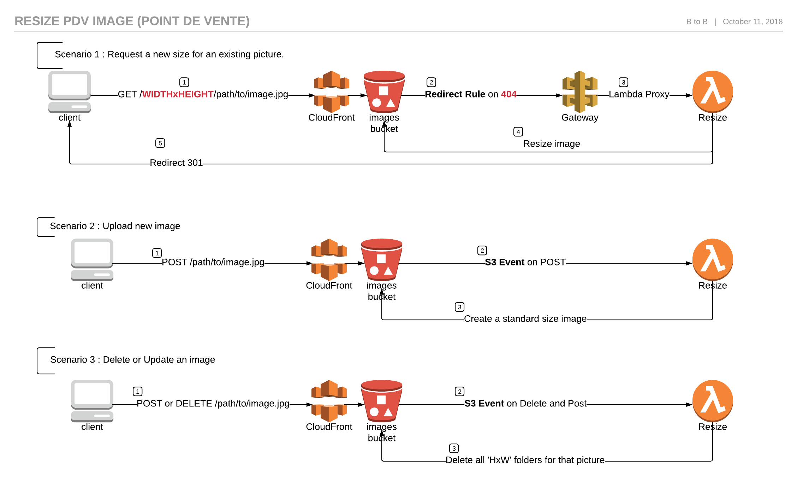

# serverless-image-resize
Inspired by : https://aws.amazon.com/fr/blogs/compute/resize-images-on-the-fly-with-amazon-s3-aws-lambda-and-amazon-api-gateway/

# Description

This project is used as a Lambda function to resizes existing images in Amazon S3.
When a targeted image size is not found in S3, a redirection rules calls the Amazon API Gateway which integrated with this Lambda to create the requested size.
The next request for the resized image will be served from S3 directly.

More info : Noe https://noe.carboatmedia.fr/display/dev/Redimensionnement+des+images+PDV



# Resize behaviour

The Lambda resizes the image to `width` x `height` given in route params.

Allowed combos : `300x220`, `150x110`, `650x330`


:warning: **Preserving aspect ratio, it resizes the image to be as large as possible while ensuring its dimensions are less than or equal to the width and height specified.
It does not enlarge the output image if the input image width or height are already less than the required dimensions.** 

# Process


## Installing / Getting started

Here's a brief intro about what a developer must do in order to start developing the project further:

```shell
git clone https://github.com/axel-springer-kugawana/cbm_serverless-image-resize.git
cd cbm_serverless-image-resize/
```
To buid this project you will need **Node 8.10 (or 6.10)** to be compatible with Lambda's versions.

- You can use this docker image to use **Node 8.10** this project :
```shell
# docker run -it -v "$PWD":/var/task lambci/lambda:build-nodejs8.10 /bin/bash
```
- Remove older installation and install : 
```shell
rm -rf node_modules/ && npm i && exit
```

And state what happens step-by-step.

## Deploying / Publishing

- Delete previous serverless stack (if needed) :
```shell
export AWS_PROFILE=cbm_your_profile_if_not_default
yarn sls:remove:dev
```

( It will delete the S3 source from Amazon S3:/applications.dev/resize-image-codepip/SourceOutp )

- Delete previous CloudFormation stack (if needed) :
```shell
aws cloudformation delete-stack --region eu-west-1 --stack-name resize-image-codepipeline-stack-dev
```

- Create CloudFormation stack :
```shell
aws cloudformation create-stack --stack-name resize-image-codepipeline-stack-dev --region eu-west-1 --template-body file://aws/cloudformation/cf-resize-image-codepipeline.yml --capabilities CAPABILITY_NAMED_IAM
```

- OR Update CloudFormation stack (then retry pipeline if needed):
```shell
aws cloudformation update-stack --stack-name resize-image-codepipeline-stack-dev --region eu-west-1 --template-body file://aws/cloudformation/cf-resize-image-codepipeline.yml --capabilities CAPABILITY_NAMED_IAM
```

- Manually link Github to AWS via the interface: 

code pipeline > edit > edit stage (source github) > edit (icon) >  connect to github
Once authenticated, fill in the repository, project and branch names, then choose the "webhook" mode in the change detection options
Done (Stage) > Save (Pipeline) > Release change


- Validate CloudFormation stack (if needed) :
```shell
aws cloudformation validate-template --region eu-west-1 --template-body file://aws/cloudformation/cf-resize-image-codepipeline.yml
```


## Configuration / Parameters


### 1. Query Parameters :
- #### "key"
Type: `String`  
The path of image to be resized. Example : `800x600/X000001/1b8d23ad3aacf8752bd72192123573fb.jpg`

### 2. Environnement :
- #### "BUCKET"
Type: `String`  
The bucket name. Example. `dev-vitrines-files`
- #### "URL"
Type: `String`  
The url of S3 storage. Example . https://s3-eu-west-1.amazonaws.com/
- #### "ALLOWED_RESOLUTIONS"
The list of allowed resolutions. Example `800x600`


## Lambda creation steps

1. Create the new Lambda : vitrines-lambda-dev-resize-image
2. Create a new Role and attach it to the Lambda   : vitrines-lambda-dev-resize-image-role
3. Create a new Policies : vitrines-resize-image-s3-dev-vitrines-files-dev
Description : Allow List, Read, Write on Bucket dev-vitrines-files
Content : 
```JSON
    {
        "Version": "2012-10-17",
        "Statement": [
            {
                "Action": [
                    "s3:ListBucket",
                    "s3:PutObject",
                    "s3:GetObject"
                ],
                "Resource": [
                    "arn:aws:s3:::dev-vitrines-files",
                    "arn:aws:s3:::dev-vitrines-files/*"
                ],
                "Effect": "Allow"
            }
        ]
    }
```
4. Bucket Configuration.
Select the Bucket > Properties > Static website hosting > Use this bucket to host a website > Redirection rules :
```XML
<RoutingRules>
  <RoutingRule>
    <Condition>
      <KeyPrefixEquals/>
      <HttpErrorCodeReturnedEquals>404</HttpErrorCodeReturnedEquals>
    </Condition>
    <Redirect>
      <Protocol>https</Protocol>
      <HostName>7i8iyjew03.execute-api.eu-west-1.amazonaws.com</HostName>
      <ReplaceKeyPrefixWith>dev/v1?key=</ReplaceKeyPrefixWith>
      <HttpRedirectCode>307</HttpRedirectCode>
    </Redirect>
  </RoutingRule>
</RoutingRules>
```


## Test via Lambda

You can use this Test Event to test this lambda function:
EventResizeTest = 
```
{
  "queryStringParameters": {
      "key" : "800x600/C000064/1b8d23ad3aacf8752bd72192123573fb.jpg"
  }
}
```

## Test via ApiGateway
```
key=800x600/C000064/1b8d23ad3aacf8752bd72192123573fb.jpg
```

## Test via S3

Delete folder "800x600" from  AWS S3 Dev, Bucket=dev-vitrines-files
When you try to get :
```
http://dev-vitrines-files.s3-website-eu-west-1.amazonaws.com/800x600/C043286/C043286_1532682815543.jpg
```
S3 will redirect to
```
https://dev-vitrines-files.s3-eu-west-1.amazonaws.com/800x600/C043286/C043286_1532682815543.jpg
```

## Test via SAM
sam local invoke "ResizeImageLambda" --env-vars env_sam.json -e event_apigateway.json
sam local generate-event apigateway aws-proxy > event_apigateway.json
sam local invoke "ResizeImageLambda" --env-vars env_sam.json -e event_apigateway.json
sam local invoke "ResizeImageLambda" --env-vars env_sam.json -e event_apigateway.json -d 5858 --debug

## Links

NEO :
https://noe.carboatmedia.fr/display/dev/Redimensionnement+des+images+PDV
