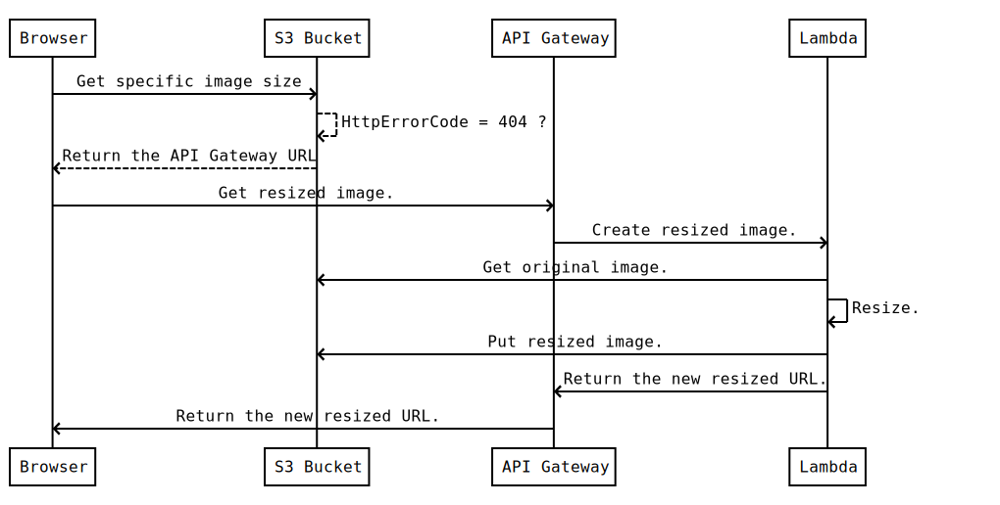
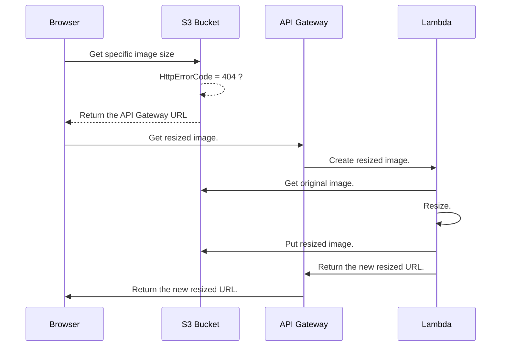

# serverless-image-resize
> Inspired by : https://aws.amazon.com/fr/blogs/compute/resize-images-on-the-fly-with-amazon-s3-aws-lambda-and-amazon-api-gateway/

# Description

This project is used as a Lambda function to resizes existing images in Amazon S3.
When a targeted image size is not found in S3, a redirection rules calls the Amazon API Gateway which integrated with this Lambda to create the requested size.
The next request for the resized image will be served from S3 directly.

More info : TODO : Neo link

# Process

This Lambda function is used behind API Gateway, S3 Bucket and the user's browser.
Sequence Diagram :





1.  A user requests a resized image from an S3 bucket through its static website hosting endpoint. The bucket has a routing rule configured to redirect to the resize API Gateway any request for an object that cannot be found.
2.  The request is temporarily redirected to the resize API method.
3.  The user’s browser follows the redirect and requests the resize operation via API Gateway.
4.  The API Gateway method is configured to trigger this Lambda function to serve the request.
5.  The Lambda function downloads the original image from the S3 bucket, resizes it, and uploads the resized image back into the bucket as the originally requested key.
6.  When the Lambda function completes, API Gateway permanently redirects the user to the file stored in S3.
7.  The user’s browser requests the now-available resized image from the S3 bucket.
8.  If the resized image is deleted in the future, the above process repeats and the resized image is re-created and replaced into the S3 bucket.


## Installing / Getting started

Here's a brief intro about what a developer must do in order to start developing the project further:

```shell
git clone https://github.com/axel-springer-kugawana/cbm_serverless-image-resize.git
cd cbm_serverless-image-resize/
```
To buid this project you will need **Node 8.10 (or 6.10)** to be compatible with Lambda's versions.

- You can use this docker image to use **Node 8.10** this project :
```shell
# docker run -it -v "$PWD":/var/task lambci/lambda:build-nodejs8.10 /bin/bash
```
- Remove older installation and install : 
```shell
rm -rf node_modules/
npm install
exit
```

And state what happens step-by-step.

## Deploying / Publishing

- Create the package :
```shell
rm -rf ../dev-lambda-resize-image.zip
zip -r ../dev-lambda-resize-image.zip *
```
- Upload to S3 (it will be used as source for Lambda :
```shell
aws s3 cp ../dev-lambda-resize-image.zip s3://dev-vitrines-files/dev-lambda-resize-image.zip
```

## Configuration / Parameters


### 1. Query Parameters :
- #### "key"
Type: `String`  
The path of image to be resized. Example : `800x600/X000001/1b8d23ad3aacf8752bd72192123573fb.jpg`

### 2. Environnement :
- #### "BUCKET"
Type: `String`  
The bucket name. Example. `dev-vitrines-files`
- #### "URL"
Type: `String`  
The url of S3 storage. Example . https://s3-eu-west-1.amazonaws.com/
- #### "ALLOWED_RESOLUTIONS"
The list of allowed resolutions. Example `800x600`


## Lambda creation steps

1. Create the new Lambda : vitrines-lambda-dev-resize-image
2. Create a new Role and attach it to the Lambda   : vitrines-lambda-dev-resize-image-role
3. Create a new Policies : vitrines-resize-image-s3-dev-vitrines-files-dev
Description : Allow List, Read, Write on Bucket dev-vitrines-files
Content : 
```JSON
    {
        "Version": "2012-10-17",
        "Statement": [
            {
                "Action": [
                    "s3:ListBucket",
                    "s3:PutObject",
                    "s3:GetObject"
                ],
                "Resource": [
                    "arn:aws:s3:::dev-vitrines-files",
                    "arn:aws:s3:::dev-vitrines-files/*"
                ],
                "Effect": "Allow"
            }
        ]
    }
```
4. Bucket Configuration.
Select the Bucket > Properties > Static website hosting > Use this bucket to host a website > Redirection rules :
```XML
<RoutingRules>
  <RoutingRule>
    <Condition>
      <KeyPrefixEquals/>
      <HttpErrorCodeReturnedEquals>404</HttpErrorCodeReturnedEquals>
    </Condition>
    <Redirect>
      <Protocol>https</Protocol>
      <HostName>7i8iyjew03.execute-api.eu-west-1.amazonaws.com</HostName>
      <ReplaceKeyPrefixWith>dev/v1?key=</ReplaceKeyPrefixWith>
      <HttpRedirectCode>307</HttpRedirectCode>
    </Redirect>
  </RoutingRule>
</RoutingRules>
```


## Test 

You can use this Test Event to test this lambda function:
EventResizeTest = 
```
{
  "queryStringParameters": {
      "key" : "/800x600/C000064/1b8d23ad3aacf8752bd72192123573fb.jpg"
  }
}
```


Test KO : https://s3-eu-west-1.amazonaws.com/dev-vitrines-files/C000064/800x600/1b8d23ad3aacf8752bd72192123573fb.jpg

Test OK : http://dev-vitrines-files.s3-website-eu-west-1.amazonaws.com/C000064/800x600/1b8d23ad3aacf8752bd72192123573fb.jpg

This test will create the new sized image in new folder "800x600" .


## Links

TODO : link to NEO.
